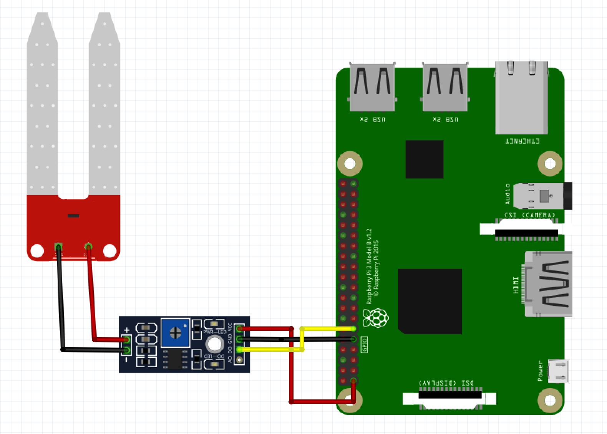
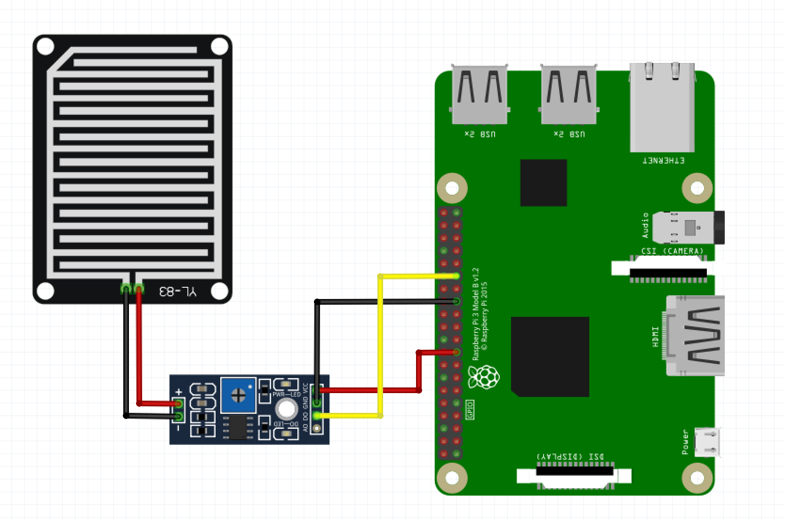
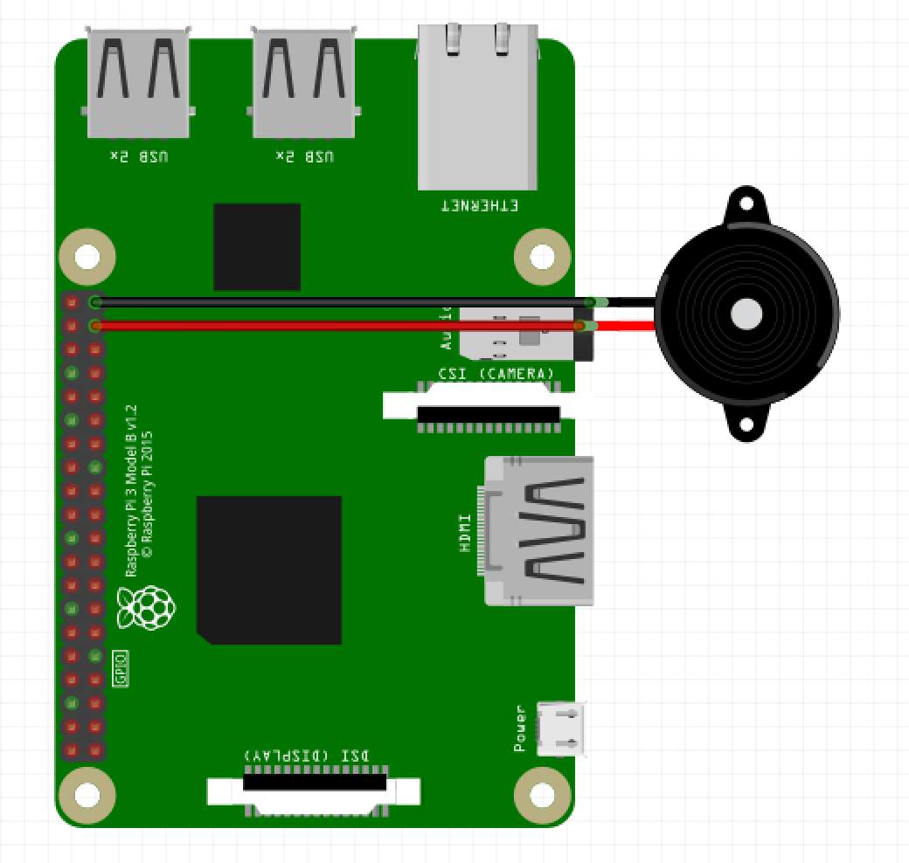

# Sensors

Simple NERVES solution which holds implementations for following sensors:

* hydration of flowers soil
* rainfall

As also Phoenix Channel-triggered buzzer which can be fired to scare unexpected intruders.

## In order to use project at home

Connect circuit according to diagrams below

### Soil moisture sensor YL-69

### Rain sensor YL-83

### Buzzer - alarm

### Configuration

* set up base endpoint url in base_url which can be found config.exs
* each sensor sends data do particular endpoint. For example hydration sends data
  to /hydrations.

### Run steps

* `export MIX_TARGET=my_target` or prefix every command with
  `MIX_TARGET=my_target`. For example, `MIX_TARGET=rpi3`
* Install dependencies with `mix deps.get`
* Create firmware with `mix firmware`
* Burn to an SD card with `mix firmware.burn`

### Future plans

* Expand application of DAC in order to read more expanded data
* Implement temperature control
* Implement motion control to detect unwanted introuders
